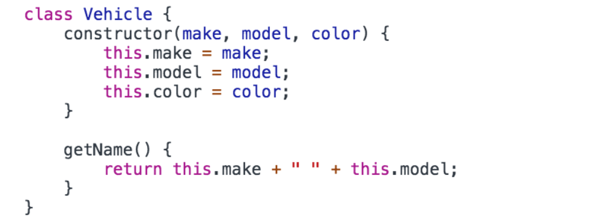
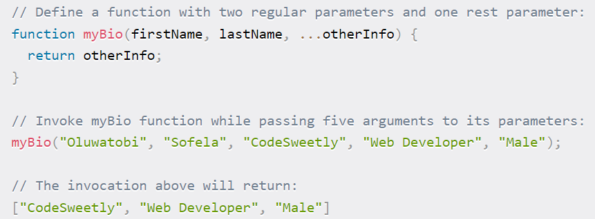
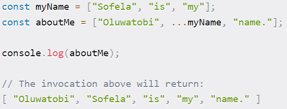

# What is JavaScript? 

- Not Java. Not at all. A godless language.
- JavaScript is a high-level scripting/programming language generally used for **front-end development**. It has built in support in all web browsers. 
  - **This is how we’ll add functionality to our webpages.**
- JS is **multi-paradigm** - it can do OOP, procedural, and functional programming etc. 
  - JS is **loosely typed.** (So variables don’t need to be defined).
  - Official language specifications for JavaScript are called **ECMAScript.** This means that when we talk about the versioning of JS we refer to “ES#”. 
    - e.g. ES6, ES7f6.
  - HTML supports the use of JS with the <script> tag, allowing you to put raw JS into the HTML page. Generally though, **you will link to an external JS file using the <script> tag at the bottom of your HTML <body> tag.** 
    - Script tags can go either in the head or the body but best practice is **generally to put them at the very bottom of the body.** Errors like are more likely to pop up if you don’t. Also good for Search Engine Optimization, because you want the skeleton/content of your webpage to show up before the JS logic gets compiled.
  - JS was originally written by a single person in ~10 days. This means there are some quirks with the language that persist to this day. 
    - See notes below on type coercion for an example.

**JS Syntax**

- Comments in JS are the same as in java: `//this is a comment`
- JavaScript literals (primitives) are your typical non-object values; they can be numbers, strings, booleans, etc
  - **number** can hold multiple number types like integers or decimals.
  - **strings** are text, enclosed by either ‘single quotes’ or “double quotes”. If a number is enclosed in quotes, it’s a string.
- JavaScript has keywords like other languages that are reserved because they have specific meaning. Eg. var, let, break, case, catch, continue, do, else, if, new, throw, etc.
- Semicolons aren’t necessary but I still like to use them;

**JavaScript Variables**

- Variables store data values. The “=” is used for the assignment operator
  - E.g. `var a = “I am a variable”`
  - Identifiers (names of the variables) must start with either a letter, underscore, or $. They cannot start with numbers, though they can contain them. No spaces!!!
- There are **3 ways to declare a variable in JS.** (let and const were added in ES6)
  - var - older, default declaration
  - let - newer and preferred declaration for mutable variables. let can be block scoped (see below).
  - const - has the functionality as let, but once assigned it can not be changed. (Like a “final” variable in Java).
- There are **7 major data types** of JS variables: 
  - number - includes ints and floating point numbers etc. 
  - string - collection of characters
  - boolean - true or false
  - null - has no value 
  - undefined - the variable has not been assigned anything. It is only declared. 
  - object - objects in JS are collections of key/value pairs. Uses {}. 
  - Symbol - added in ES6, not commonly used. 
- **Other data types** and sub-data types: 
  - BigInt is used to hold large integers outside the ability of the standard number variable.
  - NaN (not a number) is technically of the data type number. It is returned when a mathematical operation encounters a problem and can not return a valid number value. 
- The “typeof” operator returns the data type of its operand. Very useful for debugs.
- Object subtypes: 
  - **Arrays** (Big differences from Java!) - Arrays are objects that have indices, like Java. However, **a single array can hold any number of different data types and their length is not fixed.**
  - Functions are also objects but they have greatly expanded functionality. 

**JS Operators**

- Arithmetic operators: +, -, \*, /, %, ++, --
- Comparison: >, <, >=, <=, !=, ==, ===
  - **=== will compare types AND value while == simply compares value** 
    - **(ie 6 == ‘6’ returns true but not 6 === ‘6’)**
  - **Eg false == 0 returns true, while false === 0 returns false;**
- Logical: &&, ||, !
- Assignment: =, +=, -=, \*=,  /=, %=
- Ternary: `<condition> ? <value1>:<value2>`
  - This is like a one line if/else statement. If the condition is true, value1 is the result, if false value2 is. 

**Control Flow**

- The typical control flow statements you know from Java are the same with JS EXCEPT:
- for loops
  - There are 2 special types of for loops. 
    - **for-in**: iterates over an object’s keys
      - `let person = {name:”Bob”,age:25}; // this is a JS object`
      - `for(let key in person) {console.log(person[key]);} //prints Bob and 25`
    - **for-of**: iterates over the values of an array.
      - `let arr = [12, “Susie”, true, 0]; //this is a JS array`
      - `for (let value of arr) {console.log(value);}//print 12 then Susie then true then 0.`  
    - Think for-in = objects, for-of = arrays. 

**Type Coercion**

- Type coercion is **the process of converting a value from one data type to another.** There is explicit and implicit type coercion.

- **Explicit type coercion** is when we specify that we want a type changed to another type. 
  - E.g. `number(“3”), String(123)`
  - //we’re simply specifying explicitly what data type we want a certain value to change to.

- **Implicit type coercion** is where JS will attempt to carry out your instructions by changing the type variable on its own. This happens when you apply operators to values of different types.
  - E.g. `“3” \* 2;`
  - //number - JS chooses this for us. Likely because you wouldn’t multiply a String
  - E.g. `“3” + 2;`
  - //string - Likely because you commonly concatenate strings 
- Type coercion is one of those areas where JS quirkiness really shines through

\*Started HelloJS here\*

**Truthy and Falsy Values (these are actually technical terms lol)**

- In JS, **any expression or value can be evaluated as a boolean.** We use the terms truthy and falsy to indicate what boolean something will be evaluated as even if they aren’t inherently booleans. 

- There are **6 values/expressions that return as false** 
  - The boolean false
  - An empty string e.g. var a = “ “; //a is falsy
  - Undefined
  - Null
  - NaN
  - 0
- Any other value besides these 6 will return a value of true

**JS Functions**

- A function is a reusable group of code that can be called anywhere in the program. **Analogous to Java methods.**
	- You declare a function using the “function” keyword. A function can take any number of parameters you choose.
		- `function myFunction(param1, param2){}`
	- Functions can return values using the “return” keyword. You do not have to specify a return type like in Java.
	- Javascript functions are objects and can be stored in variables

- **Anonymous functions** have no identifier (name). Can be held in a variable still.
	- E.g. `let anon = function(){}`
- **Arrow functions** are “one time use” functions that are written inline
  - Analogous to lambdas in Java, they are called arrow functions because the syntax uses “=>” to make an arrow
    - E.g. `(var1) => {console.log(var1);}`
- **Callback functions** are functions that get passed into another function as a parameter, and then the original function executes the parameterized function. 
  - This is helpful in writing **asynchronous JS code.** Code generally runs from top to bottom of the file - **if code is not happening in sequence, it is considered asynchronous.** 
  - All functions in JS are objects, which means that can be passed in as parameters of other functions.
- **Closures** - This is an old way of achieving encapsulation in JS.	
  - This is a nested function that can access the variables and arguments of its outer function, but can no longer change them.

\*Finished HelloJS\*

**JS Scopes**

- JS has two major divisions of scopes: Global and Local
  - **Global scoped** variables are **accessible anywhere** in the application
  - **Local scoped** variables are **accessible only in their location**. Local locations are defined by {curly braces}
- There are two flavors of local scopes
  - **Functional Scope:** Variables declared with any keyword inside a function. They’re only accessible inside that function.
  - **Block Scope:** Variables declared inside curly braces (but not specifically a function) that are declared with the let or const keywords. They will not be accessible outside that block of code. 
    - Variables declared with var are hoisted (see below) and therefore cannot be restricted to block scope. They are GLOBALLY scoped.

**Hoisting**

- Hoisting is a default JS mechanism where **variables (specifically vars) and function declarations are moved to the top of their scope** before code execution.
  - NOTE: The variable declarations are hoisted, but the assignment isn’t. Therefore, all vars = undefined until the assignment happens in the script.
- Variables declared with let and const are not hoisted.

- What’s the point?
  - “The compiler needs to know what variables and functions are defined in scope to know what will be visible to child scopes”. 
  - This lets us do stuff like call functions before they appear in the code

**“this” Keyword**

- In JavaScript the “this” keyword has multiple meanings based on where it’s used.
  - **“this” alone** refers to the global Object. (The window object)
  - **“this” in event handlers** refers to the HTML element that receives the event. (See event handling below)
    - E.g. `<button onclick = this.style.color=”green”>click me</button>`
    - As with other inline styling, this isn’t best practice
  - **“this” in Object Method Binding** (like a constructor) refers to the object.
    - E.g. `var people = function (name, age) {
this.name = name;
this.age = age;
}`

**JS Prototypal Inheritance**

- All JS objects have a **prototype**. This is implemented through the **\_\_proto\_\_ property.** This property is used to define **inheritance in JavaScript.**
  - An object’s \_\_proto\_\_ can be set to reference another object. This will make that referenced object the parents of the object that references it.
- The **top prototype** of all objects in **Object.prototype**. This is the value that is assigned to \_\_proto\_\_ by default. 
  - Analogous to the Object class in Java

**JS Classes**

- **Classes are a special type of function in javascript**
- You can define a class with a **class declaration**
  - You use the “class” keyword with the name of the class (like declaring a function but without parenthesis for parameters).
- You can also define a class with a **class expression**
  - Here, you define a variable and then assign it to an object with the class keyword
- Classes can have a special function in the class called a “constructor” that functions like a constructor in Java (initializes the object by assigning values to its variables.)

## Document Object Model (DOM) 

- When you attach JS to HTML via the <script> tag, it will read that document and **convert the HTML elements into a JS object that can then be manipulated.**
  - This is a good look into how JS and HTML interact under the hood.
  - JS converts HTML elements into objects, hence Document Object Model

- The DOM is created as a “tree” where the root element <html> is the root of the tree, and the other elements “branch” out from the root. **Each element in the HTML is an object in the DOM.**

- In JS, you **access the DOM with the “document” object.**
  - **DOM Selection** is **accessing the elements** of the HTML through the DOM object. 
    - `document.getElementById(“idName”)` will return a single element
    - `document.getElementsByClassName(“className”)` returns an Array of elements
    - And more!!!!!!
  - **DOM Manipulation** is JS **actually changing** the elements of the DOM during run time.
    - .setAttribute will actually change the attributes of a DOM element directly
    - .appendChild creates a new element as the direct child of another element

**JS Events**

- Events occur **when user interaction takes place on the web page**, such as clicking a button, hovering over something, or pressing a key on the keyboard.
- When events occur, we can use an **event handler** (event listener) to detect them, and perform a specific action.
- Commonly used events:
  - **onclick** - when a user clicks an element
  - ondblclick - user double clicks an element
  - **onmouseover** - when the user moves the mouse pointer over the element
  - onload - happens when the browser finishes loading the page
  - onunload - happens when the page is closed
  - onresize - happens when the window is minimized or maximized
  - onkeydown - when the user pressed down on a key. 
  - onkeyup - when the user releases a key. 
  - onsubmit - when a form is submitted. 

- **EventListener** is what we use to detect events and perform some action
  - The **addEventListener function** is built into JS to handle various events. 
    - It **“listens”** for a certain event to happen, then executes some logic.
  - The syntax: `element.addEventListener(event, function, useCapture)`
    - **event -** type of event being listened for (see above for some options)
    - **function -** what code to run when the event happen** 
    - useCapture how we tell the DOM how we want events to interact between parent/child elements. We won't go too deep on this.

\*HelloDOM demo here\*

## JS Fetch API 

- JS can use the Fetch API which is a modern and versatile means of **sending asynchronous requests.** 
  - Basically, this is how we send **HTTP Requests from the frontend.** 
  - Fetch’s use of **promise objects lets us gather HTTP Responses.**

- We use the **fetch() method** on the window object, which **returns a promise** (see below). 
  - fetch() takes two parameters:
    - A **URL** that the request is sent to
    - An **object** which can contain multiple options that define the HTTP Request. This whole second parameter
      - With it, you can set the HTTP verb, headers, body, etc.

- A **promise object** represents a value that **may not be yet available, but will be resolved in the future.** Instead of receiving the value, you get a “promise” that it’ll come later. 
  - Once a promise is created, it cannot be cancelled before it’s resolved. 

- Workflow:
  - The browser **sends a request to the server/api** and creates a **promise object for the response**
  - If the HTTP request **fails** (the response has an error status code), the promise resolves and the **Fetch API rejects the promise object**
  - If we get a successful response, **the promise returns in the Response Body**

- We can extract the response data with these **methods to access response body: **
  - Big one: **response.json() - takes the response body as JSON and returns a JS object.** 
  - **response.text()** - returns the response as plain text. 
  - **response.status()** - returns the status code of the response.
 	- response.status() is quite useful if you need to take different actions based on the status code returned. 
	- E.g. `if(response.status() === 200) { //do something}` 
		- `else if(response.status() === 404) { //do something else}`
	

- Keywords
  - **async** - this is added to functions to tell them to return a promise, rather than directly return a value
  - **await** - in an asynchronous function, await will pause the function until the promise is returned
  - \*\*These two keywords will go hand in hand

\*HelloFetch demo here\*

**Timing Events**

- Timing events are used to **automate or run tasks after certain intervals of time.** Two common timing events you'll see are setTimeout() and setInterval()

- **setTimeout** takes a certain function, and an amount of milliseconds to wait before executing that function.
  - E.g. `setTimeout(myFunction, 2000)`
    - myFunction will run 2 seconds after being called
- **setInterval** takes a certain function, and executes it multiple times after a certain interval.
  - E.g. setInterval(myFunction, 2000)
    - myFunction will run every 2 seconds** 

- **Big picture:** setTimeout() invokes a function once after a wait time. setInterval() invokes a function repeatedly with a wait time between executions.

**JSON Web Token (JWT)**

- JSON Web Token (JWT) is an open standard that defines **a compact, self-contained way for transmitting information securely** between our server and client.
  - This is not Javascript specific! If you choose to use JWTs, it’ll facilitate frontend/backend communication.
- A JWT is essentially a string of characters that uniquely identifies a user. They have 3 parts:
  - The **header** typically contains the token (which is JWT) and the signing algorithm being used (such as HMAC).
  - The **payload** contains **claims,** which is the actual data being transmitted. 
  - Finally, the signature verifies that the payload was not changed along the way.

- Although JWTs can be encrypted to provide secrecy between the front/backend, we will focus on **signed tokens**
  - **Signed tokens** can verify the integrity of claims contained within it. The signature certifies that only the party holding the private key is the one that signed it. 
- Does that make sense? It didn’t to me. Think of JWTs sort of like a chip in a credit card. It allows the transaction, uniquely identifies the cardholder, and assures to the system that this transaction is legitimate. It’s an authentication and security step.

**The Rest and Spread Operators**

- In Javascript, there are two operators that use ellipses (...). Let’s see how they’re different.

- **The Rest Operator is used in a function’s parameters.** It allows us to take values the user inputs into an **Array.** 
  - Sounds a little confusing, but this code snippet should make more sense.

 

- This is a little more clear - the rest operator lets you put *the rest* of the inputted values into an Array to be used in the function. This allows for **code flexibility.**

- **The Spread Operator** is a bit easier to understand. It lets you ***spread* iterators into individual values.** 

- This lends to the concept of **destructuring assignment**, which is a Javascript expression that lets you unpack values from Arrays or other objects into individual values.
