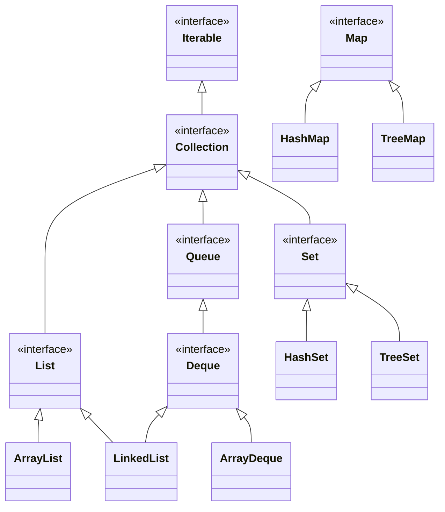
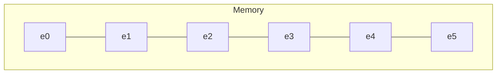
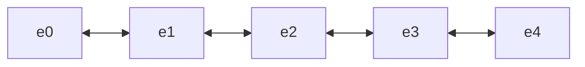

# Collections API
- Collections API is a amalgamation of interfaces and classes with a main purpose
  - The storage and *collection* of objects
  - Objects designed to hold other objects
- All collections dynamically resize
  - No running out of space in a collection when adding an element
- **List**
  - A group of objects where each object is stored with a *numerical index*
    - Values can be retrieved via this numerical index
  - Allow duplicates 
  - Objects are orderd based on when they were inserted 
- **Set**
  - Objects are ordered based on hash values for a *hashset*
  - Don't allow duplicates
  - There is no index 
    - Values cannot be retrieved via their position
- **Map**
  - Stores objects as *key value pairs*
  - There is no index
    - CANNOT loop through a map
- **Queue**
  - FIFO
    - First in First out
  - The order in which you insert objects is the order in which you retieve them
    - Just like a line/queue waiting for a roller coaster
  - There is no getting the middle of a queue
- **Stack**
  - LIFO
    - Last In First Out
  - The last object inserted is the first one returned
    - A stack of plates

- Tree vs Hash
  - Hash
    - Sorted by hashcode
  - Tree
    - **Natural Ordering**
    - Sorted by comparable

## Collections API

## Essential interfaces and implementations
- Incomplete but simplified Collections

- **Iterable**
  - Root interface of all collections in the collection framework
    - There are classes that use Iterabable that having nothing to do with collections
      - FileReaders
- **Collection**
  - This interface defines many common attritbutes all collections have
    - Adding elements
- **List**
  - Implementations of a list
    - **ArrayList**
    - **LinkedList**
- **Set**
  - Implementations of Set
    - **HashSet**
    - **TreeSet**
- **Queue**
  - Implementations of Queue
    - **LinkedList**
    - **ArrayDeque**
- **Deque**
  - Has stack and queue features
  - Implementation
    - **ArrayDeque**

- **Map**
  - Technically does not implement the Collection Interface
  - Semantically it is considered part of Collections
    - An object designed to hold other objects
  - Implenetations of Map
    - **HashMap**
    - **TreeMap**

### ArrayList 
- In an arraylist the elements are stored in a nice sequential block of memory
- Pros
  - Easy to add a new element to the end
  - Very Easy to read any element in the array
- Cons
  - Adding an element to front is a difficult
  - Java will have to shufffle over every element in the array to make space the begining

### LinkedList
- Elements are going to be scattered throughout memory
- Each element will point to the next element in the list
- Pros
  - We can easily add elements at either end
- Con
  - Difficult to read elements in the middle

